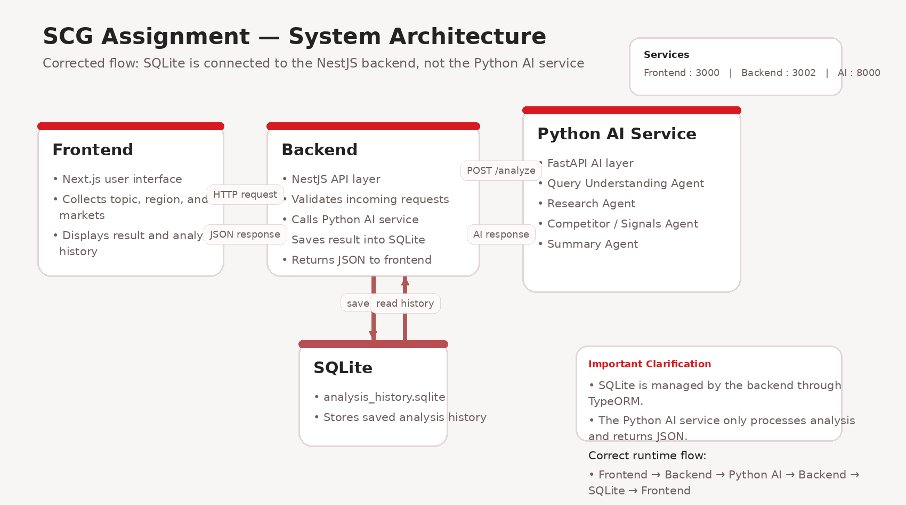

# SCG Assignment – AI Multi-Agent Market Exploration System

## 1. Project Overview

This project is a prototype AI-powered market exploration platform developed for a Full-Stack AI Engineer take-home assignment.

The system allows a user to enter a business topic, select a target region, choose one or more target markets, and receive a structured market exploration report generated through a multi-agent AI workflow.

The solution is built with the required stack:

- **AI Layer:** Python
- **Frontend:** Next.js
- **Backend:** NestJS / TypeScript
- **Database:** SQLite
- **Containerization:** Docker Compose
- **Cloud Deployment:** Google Cloud Platform (Cloud Run)

---

## 2. Deliverables Checklist

This repository includes:

- `/frontend`
- `/backend`
- `/ai-agents`
- `/docker-compose.yml`
- `README.md`

This project also includes:

- a working multi-agent workflow
- backend API integration
- database persistence for analysis history
- a simple web UI for user interaction
- Docker-based local execution
- Google Cloud Platform deployment using Cloud Run
- live deployed services for frontend, backend, and AI agents

---

## 3. Technical Stack

### AI Layer
- Python
- FastAPI
- OpenAI integration

### Frontend
- Next.js
- TypeScript
- CSS Modules

### Backend
- NestJS
- TypeScript
- TypeORM
- SQLite

### Infrastructure
- Docker
- Docker Compose
- Google Cloud Platform (GCP)
- Cloud Run
- Artifact Registry

---

## 4. System Architecture

The system is organized into three services:

### Frontend
Responsible for:
- collecting user input
- submitting analysis requests
- displaying the final market exploration result
- displaying saved history from the database

### Backend
Responsible for:
- receiving and validating API requests
- orchestrating communication between frontend and Python AI service
- saving analysis results into SQLite
- returning saved history to the frontend

### AI Service
Responsible for:
- running the multi-agent workflow
- producing structured market exploration output
- generating research, signals, and strategic summary data

### End-to-End Flow

1. User enters topic, region, and markets in the frontend
2. Frontend sends request to NestJS backend
3. Backend validates request and forwards it to Python AI service
4. Python AI service runs the AI agent workflow
5. Python AI service returns structured analysis
6. Backend stores the result in SQLite
7. Backend returns the response to the frontend
8. Frontend renders the final report

### Cloud Deployment Flow (Google Cloud Platform)

The deployed cloud version uses three separate Cloud Run services:

1. **Frontend Cloud Run service** serves the Next.js web application
2. **Backend Cloud Run service** exposes the NestJS API
3. **AI Agents Cloud Run service** exposes the FastAPI multi-agent AI layer
4. The backend communicates with the AI service through its Cloud Run URL
5. Container images are stored in **Artifact Registry**
6. OpenAI is used in the AI layer for real analysis output

### Deployed Architecture

- **Frontend:** `https://frontend-965748602065.asia-southeast1.run.app`
- **Backend:** `https://backend-965748602065.asia-southeast1.run.app`
- **AI Agents:** `https://ai-agents-965748602065.asia-southeast1.run.app`

---



## 5. AI Agent Design

The Python AI layer uses a multi-agent structure.

### 5.1 Query Understanding Agent
Purpose:
- normalize the user input
- infer intent
- identify keywords
- generate a research brief for downstream agents

Output:
- original input
- normalized query
- intent
- focus areas
- keywords
- research brief

### 5.2 Research Agent
Purpose:
- identify relevant target markets
- generate concise market insights

Output:
- keyMarkets
- marketInsights

### 5.3 Competitor / External Signals Agent
Purpose:
- identify recent developments
- summarize external signals and market movement

Output:
- recentDevelopments
- externalSignals

### 5.4 Summary Agent
Purpose:
- synthesize outputs from the other agents
- produce executive-level conclusions

Output:
- overallInsight
- opportunities
- risks

---

## 6. Design Decisions

Key design decisions made in this prototype:

### Python for AI Layer
Python was chosen because it is the most practical language for AI integration, prompt workflows, and model-facing logic.

### NestJS for Backend
NestJS was used to provide a structured backend layer for:
- API integration
- request validation
- business logic
- database integration
- orchestration between UI and AI service

### Next.js for Frontend
Next.js was used to quickly build a clean user-facing interface with strong TypeScript support.

### SQLite for Persistence
SQLite was chosen because it is simple and effective for prototype-level persistence of analysis history.

### Docker Compose for Local Orchestration
Docker Compose was used to ensure the frontend, backend, and AI layer can run together consistently in a local environment.

### Multi-Agent Separation
The AI flow was split into specialized agents instead of one monolithic prompt so that:
- responsibilities are clearer
- outputs are easier to debug
- the architecture better reflects agent-based reasoning

### Google Cloud Platform Deployment
The project was also deployed to **Google Cloud Platform** using **Cloud Run** so the full system can be accessed as a live web application without requiring local setup.

---

## 7. Project Structure

```bash
SCG_ASSIGNMENT/
├── frontend/
├── backend/
│   └── src/
│       ├── analysis/
│       ├── dto/
│       ├── market/
│       └── ...
├── ai-agents/
│   ├── agents/
│   ├── orchestrators/
│   ├── services/
│   ├── schemas.py
│   └── main.py
├── docker-compose.yml
├── system_architecture.png
└── README.md
```

---

## 8. Services and Ports

| Service | Description | Local Port |
|---|---|---|
| Frontend | Next.js UI | 3000 |
| Backend | NestJS API | 3002 |
| AI Agents | FastAPI Python AI service | 8000 |

### Cloud Services

| Service | Platform | URL |
|---|---|---|
| Frontend | Google Cloud Run | `https://frontend-965748602065.asia-southeast1.run.app` |
| Backend | Google Cloud Run | `https://backend-965748602065.asia-southeast1.run.app` |
| AI Agents | Google Cloud Run | `https://ai-agents-965748602065.asia-southeast1.run.app` |

---

## 9. Environment Setup

Before running the project locally, create a root `.env` file in the project root.

Example:

```env
APP_NAME=SCG_ASSIGNMENT
APP_ENV=development

FRONTEND_PORT=3000
PORT=3002
AI_AGENTS_PORT=8000

FRONTEND_URL=http://localhost:3000
BACKEND_URL=http://localhost:3002
NEXT_PUBLIC_API_URL=http://localhost:3002

PYTHON_AI_URL=http://ai-agents:8000

USE_OPENAI=true
OPENAI_API_KEY=openai_api_key_here
OPENAI_MODEL=gpt-5.2
```

Important:
- Replace `openai_api_key_here` with the OpenAI API key provided in the assignment email.
- The `.env` file must be created before running the project.
- For **Cloud Run**, environment variables are configured per service in Google Cloud rather than relying only on the local `.env` file.

---

## 10. Running Instructions

### Option A: Run with Docker Compose

From the project root:

```bash
docker compose up --build
```

Run in background:

```bash
docker compose up --build -d
```

Stop services:

```bash
docker compose down
```

View logs:

```bash
docker compose logs -f
```

### Option B: Run Locally Without Docker

#### Frontend
```bash
cd frontend
npm install
npm run dev
```

#### Backend
```bash
cd backend
npm install
npm run start:dev
```

#### AI Agents
```bash
cd ai-agents
pip install -r requirements.txt
uvicorn main:app --reload --port 8000
```

### Option C: Run on Google Cloud Platform

The full system is deployed on **Google Cloud Platform** using **Cloud Run**.

#### Deployment Summary
- Docker images are built locally
- Images are pushed to **Artifact Registry**
- Three separate Cloud Run services are deployed:
  - `frontend`
  - `backend`
  - `ai-agents`

#### Live URLs
- Frontend: `https://frontend-965748602065.asia-southeast1.run.app`
- Backend: `https://backend-965748602065.asia-southeast1.run.app`
- AI Agents: `https://ai-agents-965748602065.asia-southeast1.run.app`

#### Cloud Notes
- Backend CORS is configured to allow the deployed frontend URL
- The AI service is configured with OpenAI credentials in Cloud Run environment variables
- The frontend is built with the backend Cloud Run URL injected at build time

---

## 11. How to Use the System

1. Open the frontend in the browser
2. Enter a market topic
3. Select a region
4. Select one or more markets
5. Click **Analyze Market**
6. Review the generated report
7. Review previous saved analyses from the history panel

### Live Demo Entry Point
Use the deployed frontend:

`https://frontend-965748602065.asia-southeast1.run.app`

---

## 12. API Endpoints

### Backend

#### `POST /market/analyze`
Runs market analysis, saves the result to SQLite, and returns the final report.

Example request:

```json
{
  "topic": "Green cement",
  "region": "Southeast Asia",
  "markets": ["Thailand", "Vietnam", "Indonesia"]
}
```

#### `GET /market/history`
Returns saved analysis history.

#### `GET /api/health`
Returns backend health status.

### AI Service

#### `GET /health`
Returns AI service health status.

#### `POST /analyze`
Runs the Python multi-agent workflow and returns structured analysis.

### Cloud Endpoint Examples

#### Backend
- `https://backend-965748602065.asia-southeast1.run.app/market/history`

#### AI Service
- `https://ai-agents-965748602065.asia-southeast1.run.app/health`

---

## 13. Database

The backend stores analysis results in SQLite using TypeORM.

Current persistence covers:
- topic
- region
- markets
- keyMarkets
- marketInsights
- recentDevelopments
- externalSignals
- overallInsight
- opportunities
- risks
- createdAt

Database file:
- `analysis_history.sqlite`

### Database Note for Cloud Deployment
SQLite is suitable for this prototype and works well for local development.  
For the Cloud Run deployment, SQLite is acceptable for demonstration purposes, but a production-ready version should move to a managed database such as PostgreSQL or Cloud SQL.

---

## 14. System Demo Coverage

This prototype demonstrates:

- **multi-agent workflow**
  - query understanding
  - research generation
  - competitor / external signal generation
  - executive summary generation

- **AI reasoning**
  - structured decomposition of analysis into specialized steps
  - synthesis of multiple agent outputs

- **user interaction through a simple UI**
  - form-based input
  - result rendering
  - database-backed history view

- **cloud-based deployment**
  - live frontend on Google Cloud Platform
  - live backend API on Cloud Run
  - live AI service on Cloud Run
  - end-to-end request flow across all deployed services

---

## 15. Assumptions

- This is a prototype assignment, not a production-ready system
- A valid OpenAI API key is required for real AI output
- Docker Compose is the primary recommended way to run the system locally
- SQLite is sufficient for prototype-level persistence
- Google Cloud Platform deployment is included as an optional cloud extension to the system design

---

## 16. Limitations

- No authentication or access control
- SQLite is not intended for production scale
- AI output quality depends on prompt design and model behavior
- Error handling is prototype-level
- The current UI focuses on clarity and workflow demonstration over production polish
- Cloud Run deployment currently uses prototype-oriented infrastructure choices rather than full production hardening

---

## 17. Future Improvements

Possible future improvements include:

- stronger source grounding and citation quality
- richer report formatting
- better persistence of detailed agent metadata
- improved observability and logging
- migration from SQLite to a managed cloud database
- stronger market-specific retrieval and external data enrichment
- more production-ready cloud infrastructure and secrets management

---

## 18. Summary

This project satisfies the assignment goal of building an end-to-end AI application with:

- a **Python AI layer**
- a **TypeScript frontend**
- a **NestJS backend**
- **database integration**
- **Docker-based orchestration**
- a **multi-agent workflow**
- a **simple user interface for interaction**
- **Google Cloud Platform deployment using Cloud Run**

It is designed as a working prototype that demonstrates architecture, integration, cloud deployment, and AI-agent-based reasoning across the full stack.
